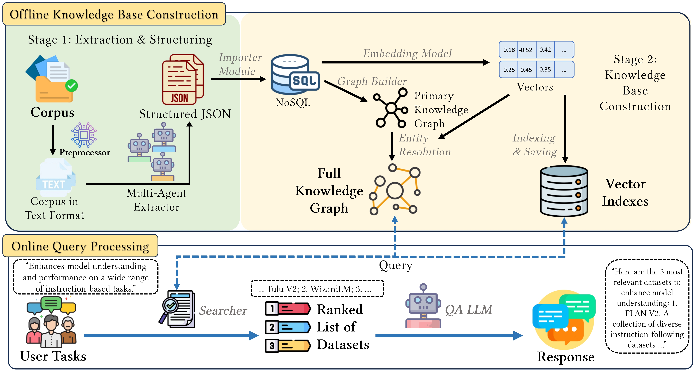

# KATS: Knowledge graph-Augmented Task-oriented dataset Search

[](https://opensource.org/licenses/MIT) [](https://www.python.org/downloads/)

<!-- [](https://github.com/starkersawz666/KATS) -->

Knowledge graph-Augmented Task-oriented dataset Search (KATS) is a system designed to help researchers and developers discover relevant datasets by describing their specific tasks. It uses Large Language Models, vector embeddings, and knowledge graphs to automatically process a corpus of documents (e.g. academic papers), extract information about datasets, and build a searchable index. Users can then query this index using natural language task descriptions to find suitable datasets.

<p align="center">
  
</p>
<p align="center">
  <b>Figure 1:</b> Overall Architecture of the KATS System
</p>

## Installation ⚙️

### Prerequisites

- Python 3.11 or higher.
- An OpenAI API Key. You need to set this as an environment variable:
  ```bash
  export OPENAI_API_KEY="your_openai_api_key_here"
  ```

### From Release

1.  Navigate to the [**Releases**](https://github.com/starkersawz666/task-oriented-dataset-search/releases) page of this repository.
2.  Download the latest `.whl` (wheel) file appropriate for your system.
3.  Install the wheel file using `pip`:
    ```bash
    pip install path/to/downloaded_wheel_file.whl
    ```
    This will install the KATS package and its dependencies.

## Quick Start 🚀

You can use the KATS pipeline programmatically as shown below. For a more detailed walkthrough, please refer to the example notebook: [`examples/demo.ipynb`](https://github.com/starkersawz666/task-oriented-dataset-search/blob/pipeline/examples/demo.ipynb).

Make sure you have set your `OPENAI_API_KEY` environment variable, or deployed your own model before running the code.

## Code Structure 🏗️

```
📦 KATS-pipeline
│
├── 📂 src/task_oriented_dataset_search
│   │
│   ├── 📂 preprocessing          # Responsible for loading and preprocessing input documents
│   │   ├── __init__.py
│   │   ├── loader.py             # Defines classes for loading different document formats
│   │   └── processor.py          # Performs text cleaning and preparation on loaded documents
│   │
│   ├── 📂 extraction             # Extracts structured information from text using LLMs
│   │   ├── 📂 prompts            # Contains prompt templates to guide LLM for information extraction
│   │   │   ├── ...
│   │   ├── __init__.py
│   │   ├── client.py             # Encapsulates the client for interacting with Large Language Models (e.g., OpenAI API)
│   │   └── extractor.py          # Implements the core logic for information extraction
│   │
│   ├── 📂 importer               # Imports the extracted information into the database
│   │   ├── __init__.py
│   │   └── db_importer.py        # Responsible for storing structured data into a TinyDB database
│   │
│   ├── 📂 embedding              # Converts text data into vectors and builds an index
│   │   ├── __init__.py
│   │   ├── embedder.py           # Implements text-to-vector conversion
│   │   ├── indexer.py            # Uses Faiss to build an efficient search index for vectors
│   │   └── pipeline.py           # Coordinates the entire embedding and indexing process
│   │
│   ├── 📂 graph                  # Builds and optimizes the knowledge graph between datasets and tasks
│   │   ├── __init__.py
│   │   ├── builder.py            # Builds the initial knowledge graph from database information
│   │   ├── dataset_merger.py     # Identifies and merges duplicate dataset nodes in the graph
│   │   └── task_merger.py        # Identifies and merges similar task nodes in the graph
│   │
│   ├── 📂 search                 # Implements the final search and question-answering functionality
│   │   ├── 📂 prompts            # Contains prompt templates for generating the final answer
│   │   │   └── qa_prompt.txt
│   │   ├── __init__.py
│   │   ├── qa.py                 # Generates natural language answers using LLM based on retrieval results
│   │   └── searcher.py           # Performs core search by combining vector index and knowledge graph
│   │
│   ├── 📂 utils                  # Contains common utility functions for the project
│   │   ├── __init__.py
│   │   └── cache.py              # Provides caching functionality to avoid redundant computations
│   │
│   ├── __init__.py
│   ├── cli.py                    # Provides a command-line interface to execute different stages of the pipeline
│   └── pipeline.py               # Defines and configures the core engine 'TodsEngine' for the entire project pipeline
│
├── 📜 .gitignore                # Specifies files to be ignored by Git
├── 📜 pyproject.toml            # Defines project metadata and dependencies
└── 📜 README.md                 # Project introduction and usage documentation
```

## Our future plans 🏹

- [ ] Detailed README;
- [ ] Methods for adding knowledge to KG;
- [ ] More LLM presets, such as AZURE and locally deployed models.

If you have any questions or suggestions, please feel free to open an issue or pull request.

## Contact ✉️

File an issue or contact us: [Zixin Wei](mailto:zixinwei1@link.cuhk.edu.cn), The Chinese University of Hong Kong, Shenzhen

## License 📝

This project is licensed under the [MIT License](LICENSE).
